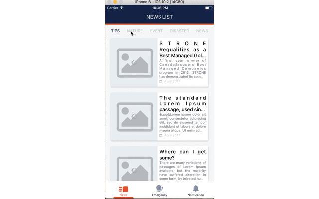

# react-native-image-placeholder  [](https://badge.fury.io/js/react-native-image-placeholder)

[](https://nodei.co/npm/react-native-image-placeholder/)

- Support Android and iOS.
- The image component that supports shows placeholderSource when load image network.
- Show placeholderSource if the main source can't be loaded or error.
- Support custom ActivityIndicator loading.



## Require
React-native >= 0.46.x

## What's new
Fixed render inside <ImageLoad /> component

## Installation

```bash
npm i --save react-native-image-placeholder
```

Please file an issue if you have any trouble!


## Usage

```jsx
import ImageLoad from 'react-native-image-placeholder';

....

<ImageLoad
    style={{ width: 320, height: 250 }}
    loadingStyle={{ size: 'large', color: 'blue' }}
    source={{ uri: 'https://4.bp.blogspot.com/-lYq2CzKT12k/VVR_atacIWI/AAAAAAABiwk/ZDXJa9dhUh8/s0/Convict_Lake_Autumn_View_uhd.jpg' }}
/>
```
## Options
Supports all [Image](https://facebook.github.io/react-native/docs/images.html) properties.

Option |Default |Info
------ |---- |----
placeholderSource |require('./Images/empty-image.png') |Show `placeholderSource` if the `source` can't be loaded or error.
loadingStyle |size: 'small'; color: 'gray' | Style ActivityIndicator
isShowActivity | true | Show ActivityIndicator loading
placeholderStyle | | Style placeholder image
customImagePlaceholderDefaultStyle | | Custom style image placeholder default
borderRadius | | Border radius
## License

ISC
